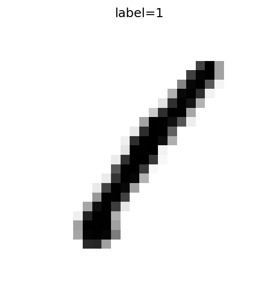
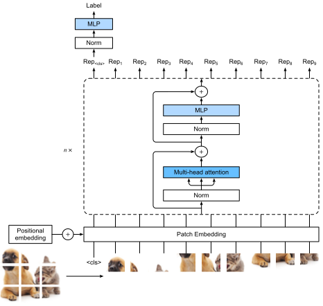
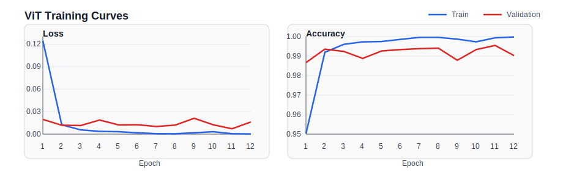
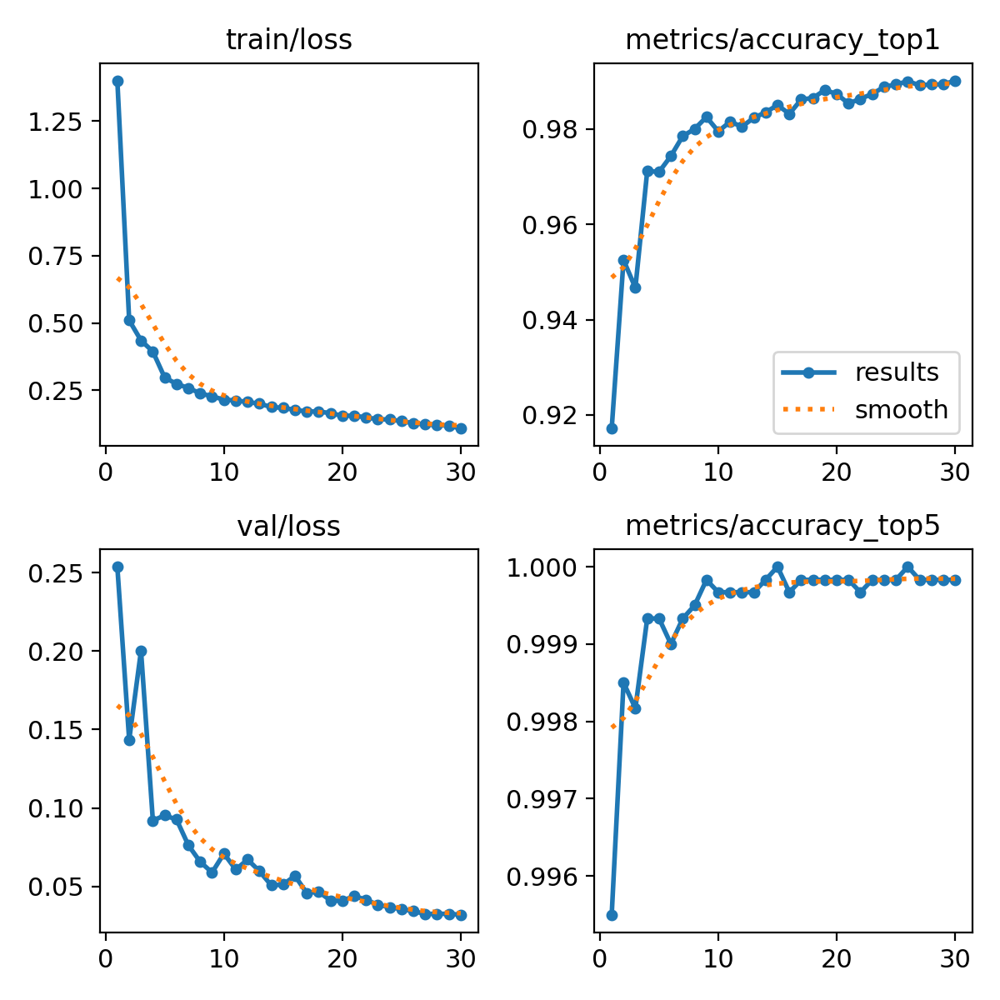
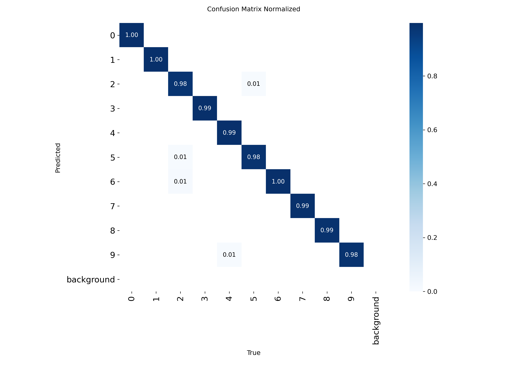

# MNIST 데이터셋 실험 보고서

MNIST 손글씨 숫자 분류 문제에서 두 가지 경로를 비교한 기록이다.  
관심사는 코드 구현 자체보다, 어떤 접근이 실제로 어떤 성능을 냈고 그 결과를 어디까지 믿을 수 있는지에 있다.

## 목차

- [보고서 범위](#보고서-범위)
- [데이터와 비교 조건](#데이터와-비교-조건)
  - [데이터 출처](#데이터-출처)
  - [비교 조건](#비교-조건)
- [접근 개요](#접근-개요)
  - [Vision Transformer](#vision-transformer)
  - [YOLO classification](#yolo-classification)
- [실험 설정](#실험-설정)
  - [ViT 전이학습](#vit-전이학습)
  - [YOLO classification 반복 실험](#yolo-classification-반복-실험)
- [실험 결과](#실험-결과)
  - [모델 간 요약](#모델-간-요약)
  - [ViT 결과](#vit-결과)
  - [YOLO classification 결과](#yolo-classification-결과)
- [해석](#해석)
- [한계](#한계)
- [결론](#결론)
- [참고 문헌 및 그림 출처](#참고-문헌-및-그림-출처)

## 보고서 범위

이 보고서는 현재 저장소에서 결과를 직접 확인할 수 있는 두 경로만 다룬다.

- ViT 기반 전이학습
- YOLO classification 기반 분류

비교의 핵심은 다음 두 가지다.

- ViT 단일 run이 어느 정도까지 올라갔는가
- YOLO classification이 반복 실험에서도 비슷한 성능을 유지하는가

## 데이터와 비교 조건

### 데이터 출처

본 보고서에서 참조한 공개 데이터 출처는 다음과 같다.

1. [Kaggle Digit Recognizer Competition](https://www.kaggle.com/competitions/digit-recognizer)
2. [MNIST Dataset (Kaggle mirror)](https://www.kaggle.com/datasets/hojjatk/mnist-dataset)

ViT 실험은 첫 번째 출처의 `train.csv`를 사용했고, YOLO classification 실험은 두 번째 출처와 같은 MNIST IDX 형식을 사용했다.

그림 1. MNIST 입력 샘플. 이 실험은 저해상도 grayscale 숫자 영상을 0부터 9까지의 클래스로 분류하는 문제를 다룬다.

### 비교 조건

두 실험은 모두 같은 문제를 푼다. 다만 실험 조건은 완전히 같지 않다.

- ViT는 Kaggle CSV 버전을 사용했다.
- YOLO는 raw MNIST IDX를 사용했다.
- 저장소에 남아 있는 train/validation split도 서로 다르다.

그래서 이 문서의 비교는 "같은 문제를 어떤 방식으로 풀었는가"를 보는 비교이지, 같은 데이터 분할 위에서 측정한 엄밀한 리더보드는 아니다.

## 접근 개요

### Vision Transformer

Vision Transformer(ViT)는 이미지를 patch 단위로 나눈 뒤, 각 patch를 토큰처럼 다루는 분류 모델이다. 본 실험에서는 `facebook/deit-small-patch16-224`를 MNIST에 맞게 미세조정했다.

그림 2. Vision Transformer의 기본 구조. 입력 이미지를 patch 단위로 분할하고, patch embedding과 positional embedding을 더한 뒤 Transformer encoder를 거쳐 최종 분류를 수행한다.

ViT는 전역 문맥을 한 번에 본다는 장점이 있다. 대신 MNIST처럼 작은 입력에서는 28x28 이미지를 224x224로 키워 넣는 비용이 꽤 크다. 잘 맞으면 성능은 높게 나올 수 있지만, 계산량이 가벼운 쪽은 아니다.

### YOLO classification

본 실험에서 사용한 `yolo26n-cls.pt`는 Ultralytics의 classification 전용 분기다. 입력 이미지 전체에 대해 단일 class label과 confidence score를 출력한다.

MNIST처럼 이미지 하나에 숫자 하나가 들어 있는 문제에서는 이런 분류 설정이 단순하다. 반복 실험을 돌려서 안정성을 보기도 쉽다.

## 실험 설정

### ViT 전이학습

ViT 경로는 `facebook/deit-small-patch16-224`를 MNIST 분류에 맞게 파인튜닝하는 방식이다.

- 입력 데이터: Kaggle Digit Recognizer 형식의 `train.csv`
- 학습/검증 분할: `37,800 / 4,200`
- 원본 CSV 크기: `42,000` labeled train rows, `28,000` unlabeled test rows
- 28x28 grayscale 이미지를 RGB로 변환
- Hugging Face `AutoImageProcessor`, `AutoModelForImageClassification` 사용
- backbone과 classifier head에 서로 다른 learning rate 적용
- focal loss와 클래스 가중치 사용
- validation loss 기준 early stopping 적용

### YOLO classification 반복 실험

YOLO 쪽에서 실제 결과가 남아 있는 실험은 classification 경로다.

- 입력 데이터: raw MNIST IDX
- 학습/검증/테스트 분할: `54,000 / 6,000 / 10,000`
- 총 사용 라벨 데이터: `60,000 train + 10,000 test`
- 모델: `yolo26n-cls.pt`
- epochs: `30`
- batch: `128`
- image size: `32`
- patience: `10`
- pretrained: `true`

반복 실행된 run은 다음 네 개다.

- `mnist-yolo26n-ensemble-seed42`
- `mnist-yolo26n-ensemble-seed52`
- `mnist-yolo26n-ensemble-seed62`
- `mnist-yolo26n-ensemble-seed72`

## 실험 결과

### 모델 간 요약

표 1은 현재 저장소에서 직접 확인 가능한 핵심 결과를 접근별로 정리한 것이다.

표 1. 모델 간 핵심 결과 요약.

| 접근 | 현재 확인 가능한 핵심 결과 | 해석 |
| --- | --- | --- |
| ViT 전이학습 | `best_val_loss = 0.0071516539`, `best_val_acc = 0.99548` | 단일 run 기준으로는 강한 성능이 나왔지만 반복 검증은 아직 없다 |
| YOLO classification | 최고 top-1 `0.99017`, 평균 `0.989585` | 최고점은 ViT보다 낮지만 반복 실험 기준으로는 가장 안정적이다 |

### ViT 결과

ViT 쪽에서 현재 확인 가능한 대표 수치는 다음과 같다.

- 모델: `facebook/deit-small-patch16-224`
- best validation loss: `0.0071516539`
- best validation accuracy: `0.99548`
- best epoch: `11 / 12`
- train/val split: `37,800 / 4,200`

학습 기록을 보면 초반 수렴이 빠르고, epoch 11에서 검증 성능이 가장 좋다. epoch 12에서는 train loss는 더 내려가지만 validation 성능은 다시 떨어져서, best checkpoint가 어느 지점인지도 비교적 분명하다.

표 2. ViT epoch별 학습 기록.

| Epoch | Train Loss | Train Acc | Val Loss | Val Acc |
| --- | --- | --- | --- | --- |
| 1 | `0.12462` | `0.95021` | `0.01961` | `0.98667` |
| 2 | `0.01231` | `0.99196` | `0.01189` | `0.99357` |
| 3 | `0.00569` | `0.99603` | `0.01147` | `0.99238` |
| 4 | `0.00363` | `0.99728` | `0.01875` | `0.98881` |
| 5 | `0.00321` | `0.99746` | `0.01235` | `0.99262` |
| 6 | `0.00181` | `0.99857` | `0.01248` | `0.99333` |
| 7 | `0.00054` | `0.99960` | `0.01015` | `0.99381` |
| 8 | `0.00046` | `0.99958` | `0.01201` | `0.99405` |
| 9 | `0.00175` | `0.99868` | `0.02113` | `0.98786` |
| 10 | `0.00322` | `0.99730` | `0.01250` | `0.99333` |
| 11 | `0.00053` | `0.99937` | `0.00715` | `0.99548` |
| 12 | `0.00021` | `0.99979` | `0.01629` | `0.99024` |

그림 3. ViT 학습 곡선. 왼쪽은 train/validation loss, 오른쪽은 train/validation accuracy다. epoch 11에서 validation 성능이 가장 좋고, epoch 12에서는 train 성능이 더 올라가지만 validation 성능은 다시 내려간다.

아쉬운 점도 있다. 저장소에는 ViT confusion matrix나 오분류 예시 같은 후속 산출물이 남아 있지 않다. 그래서 숫자 자체는 좋지만, 어떤 클래스에서 흔들렸는지까지는 지금 문서에서 보여주지 못한다.

### YOLO classification 결과

표 3은 YOLO classification 반복 실험의 seed별 성능을 비교한 결과다.

표 3. YOLO classification 반복 실험의 seed별 성능 비교.

| Seed | 최고 Top-1 Accuracy | 최소 Validation Loss | 최적 Epoch |
| --- | --- | --- | --- |
| 42 | `0.98917` | `0.03729` | `24` |
| 52 | `0.98967` | `0.03206` | `28` |
| 62 | `0.98933` | `0.03287` | `29` |
| 72 | `0.99017` | `0.03183` | `30` |

요약 통계는 다음과 같다.

- 평균 top-1 accuracy: `0.989585`
- top-1 accuracy 표준편차: `0.000383`
- 평균 validation loss: `0.0335125`

이 수치가 말해주는 건 단순하다. YOLO classification은 한 번만 잘 나온 결과가 아니다. seed를 바꿔도 비슷한 범위에 머문다. 이 점이 이 모델을 현재 저장소에서 가장 믿기 쉬운 기준선으로 만든다.

그림 4. YOLO classification `seed72` 실험의 학습 곡선. train loss와 validation loss가 전반적으로 안정적으로 내려가고, top-1 accuracy는 약 0.99 수준까지 수렴한다.

그림 5. YOLO classification `seed72` 실험의 정규화 confusion matrix. 대부분 클래스에서 예측이 대각선에 모여 있고, 일부 비슷한 숫자 쌍에서만 제한적인 혼동이 보인다.

## 해석

이 문서에서 읽어야 할 포인트는 둘이다.

첫째, 단일 최고 성능만 보면 ViT가 더 높다. 현재 남아 있는 기록 기준으로 ViT의 best validation accuracy는 `0.99548`이고, YOLO classification의 최고 top-1 accuracy는 `0.99017`이다.

둘째, 반복 실험까지 포함해 보면 YOLO classification 쪽이 더 안정적이다. 같은 방식으로 여러 번 돌린 기록이 남아 있고, seed를 바꿔도 성능 변동이 작다. 반면 ViT는 현재 단일 run 기록만 있어서, 이 숫자가 얼마나 재현되는지는 아직 말하기 어렵다.

그래서 지금 시점의 정리는 이렇게 하는 편이 자연스럽다.

- 최고 단일 성능은 ViT가 보여줬다.
- 가장 안정적으로 검증된 기준 모델은 YOLO classification이다.
- 두 결과를 정면 비교할 때는 split과 입력 포맷 차이를 계속 의식해야 한다.

## 한계

이 보고서는 저장소에 남아 있는 결과를 기준으로 썼다. 그래서 한계도 분명하다.

- ViT와 YOLO는 같은 문제를 풀지만, 저장된 결과는 같은 공개 split 위에서 나온 것이 아니다.
- ViT는 현재 단일 run 기록만 남아 있다.
- ViT는 confusion matrix나 오분류 예시가 없다.

즉, 이 문서는 완성된 리더보드라기보다 현재 확보된 실험 기록을 정리한 중간 보고서에 가깝다.

## 결론

지금 기준으로 가장 깔끔하게 말할 수 있는 결론은 다음과 같다.

- 최고 단일 성능은 `ViT`가 기록했다.
- 가장 안정적으로 검증된 기준 모델은 `YOLO classification`이다.
- 다음 단계는 ViT를 같은 split 기준으로 반복 실험하고, confusion matrix와 오분류 예시까지 남기는 것이다.

대표 결과를 하나만 먼저 보여줘야 한다면 YOLO classification이 더 안전하다. 반대로 "단일 run에서 어디까지 올라갈 수 있었나"를 보여주고 싶다면 ViT가 더 눈에 띈다.

## 참고 문헌 및 그림 출처

- [Dosovitskiy et al., *An Image is Worth 16x16 Words: Transformers for Image Recognition at Scale*](https://arxiv.org/abs/2010.11929)
- [Ultralytics Docs, *Image Classification*](https://docs.ultralytics.com/tasks/classify/)
- [Wikipedia, *Vision transformer*](https://en.wikipedia.org/wiki/Vision_transformer)
