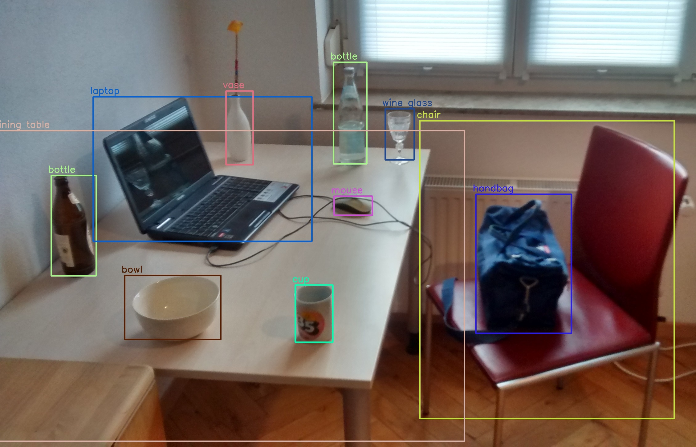

# MNIST 데이터셋 실험 보고서

MNIST 손글씨 숫자 분류 문제를 대상으로 진행한 실험을 정리한 문서다.  
관심사는 어떤 코드를 만들었는지보다, 어떤 접근이 실제로 어느 정도 성능을 보였고 그 차이를 어떻게 해석할 수 있는지에 있다.

## 목차

- [실험 목적](#실험-목적)
- [데이터셋과 평가 조건](#데이터셋과-평가-조건)
  - [데이터 출처](#데이터-출처)
  - [ViT 실험](#vit-실험)
  - [YOLO classification 실험](#yolo-classification-실험)
- [이론적 배경](#이론적-배경)
  - [Vision Transformer](#vision-transformer)
  - [YOLO classification과 detect](#yolo-classification과-detect)
  - [Soft Voting 앙상블](#soft-voting-앙상블)
- [데이터 예시와 시각 자료](#데이터-예시와-시각-자료)
- [실험별 설정](#실험별-설정)
  - [1. ViT 전이학습](#1-vit-전이학습)
  - [2. YOLO classification](#2-yolo-classification)
  - [3. YOLO + CNN 앙상블](#3-yolo--cnn-앙상블)
  - [4. YOLO detect 형식 변환](#4-yolo-detect-형식-변환)
- [실험 결과](#실험-결과)
  - [요약 결과](#요약-결과)
  - [YOLO classification 세부 결과](#yolo-classification-세부-결과)
  - [ViT 결과](#vit-결과)
- [결과 해석](#결과-해석)
- [한계](#한계)
- [참고 문헌 및 그림 출처](#참고-문헌-및-그림-출처)
- [결론](#결론)

## 실험 목적

이 실험의 목표는 손글씨 숫자 분류 문제에서 서로 다른 모델링 접근을 비교하는 것이다.  
저장소 안에는 크게 네 가지 흐름이 있다.

- ViT 기반 전이학습
- YOLO classification 기반 분류
- YOLO + CNN soft voting 앙상블
- YOLO detect 형식으로 문제를 바꿔보는 실험

이 가운데 실제 성능 비교가 가능한 것은 ViT 일부 결과와 YOLO classification 반복 실험이다. 앙상블과 detect 경로는 구현은 되어 있지만, 현재 저장소 기준으로는 최종 비교 수치가 충분히 남아 있지 않다.

## 데이터셋과 평가 조건

이 실험들은 모두 같은 MNIST 손글씨 숫자 분류 문제를 다룬다.  
다만 저장소에 남아 있는 실행 경로는 데이터 포맷과 공개 split이 완전히 같지는 않다.

### 데이터 출처

본 보고서에서 참조한 공개 데이터 출처는 다음과 같다.

1. [Kaggle Digit Recognizer Competition](https://www.kaggle.com/competitions/digit-recognizer)
2. [MNIST Dataset (Kaggle mirror)](https://www.kaggle.com/datasets/hojjatk/mnist-dataset)

ViT 실험은 첫 번째 출처의 `train.csv` 형식을 사용했고, YOLO classification 실험은 두 번째 출처와 동일한 MNIST IDX 형식을 사용했다.

### ViT 실험

- 입력 데이터: Kaggle Digit Recognizer 형식의 `train.csv`
- 학습/검증 분할: `37,800 / 4,200`
- 원본 CSV 크기: `42,000` labeled train rows, `28,000` unlabeled test rows

### YOLO classification 실험

- 입력 데이터: raw MNIST IDX
- 학습/검증/테스트 분할: `54,000 / 6,000 / 10,000`
- 총 사용 라벨 데이터: `60,000 train + 10,000 test`

정리하면 두 계열은 모두 같은 MNIST 숫자 분류 실험이라고 볼 수 있다.  
다만 현재 저장소 기준으로는 ViT가 Kaggle CSV 버전을, YOLO가 IDX 버전을 사용했고 공개 split도 다르다. 그래서 여기서의 비교는 "같은 문제에 대한 결과 비교"에는 해당하지만, 완전히 같은 조건에서 측정된 벤치마크라고 보긴 어렵다.

## 이론적 배경

### Vision Transformer

Vision Transformer(ViT)는 입력 영상을 고정 크기 patch로 분할한 뒤, 각 patch를 토큰처럼 다루는 분류 모델이다. 각 patch는 선형 투영을 통해 embedding으로 변환되고, 위치 정보는 positional embedding으로 더해진다. 이후 encoder-only Transformer가 self-attention으로 patch 사이의 관계를 학습하며, 최종적으로 분류 토큰 또는 pooling 출력을 이용해 클래스 확률을 계산한다. 본 실험의 ViT 경로는 이 계열의 `facebook/deit-small-patch16-224` 모델을 MNIST에 맞게 미세조정하는 방식이다.

그림 1. Vision Transformer의 기본 구조. 입력 이미지를 patch 단위로 분할하고, patch embedding과 positional embedding을 더한 뒤 Transformer encoder를 거쳐 최종 분류를 수행한다.

ViT는 전역 문맥을 한 번에 볼 수 있다는 장점이 있지만, CNN보다 inductive bias가 약하므로 충분한 사전학습이나 적절한 regularization이 중요하다. 특히 MNIST처럼 입력 구조가 단순한 문제에서는 높은 표현력을 얻는 대신 계산 비용이 커질 수 있다.

### YOLO classification과 detect

YOLO는 입력 영상 전체를 한 번에 처리하는 single-stage 계열 모델이다. 원래 YOLO의 핵심 아이디어는 이미지를 grid 수준으로 해석하면서, 한 번의 forward pass에서 bounding box와 class probability를 함께 예측하는 것이다. 그래서 위치 추정과 분류를 동시에 처리해야 하는 객체 탐지 문제에 잘 맞는다.

그림 2. YOLO 기반 객체 탐지 예시. 하나의 이미지에서 여러 객체의 위치와 클래스를 동시에 예측하는 single-stage 탐지의 전형적인 출력 형태를 보여준다.

반면 본 실험에서 사용한 `yolo26n-cls.pt`는 Ultralytics의 classification 전용 분기다. 공식 문서 기준으로 classification 모델은 `-cls` suffix를 사용하며, 이미지 전체에 대해 단일 class label과 confidence score를 출력한다. MNIST처럼 이미지 하나에 숫자 하나가 중심에 놓인 문제에서는 bounding box를 함께 예측하는 detect보다 classify formulation이 더 직접적이고, 구현과 반복 실험도 단순하다.

### Soft Voting 앙상블

Soft voting 앙상블은 여러 모델이 출력한 클래스별 확률 벡터를 평균한 뒤, 평균 확률이 가장 높은 클래스를 최종 예측으로 선택하는 방식이다. 서로 다른 모델이 서로 다른 오답 패턴을 보일 때는 평균화 과정이 오분류를 줄이는 데 도움이 될 수 있다.

다만 이 방식이 항상 유리한 것은 아니다. MNIST처럼 단일 모델 정확도가 이미 매우 높은 문제에서는 추가 모델이 주는 이득이 작을 수 있고, 그에 비해 학습 시간과 추론 비용은 바로 증가한다. 따라서 앙상블은 단일 최고 모델 대비 유의미한 성능 향상이 수치로 확인될 때 유지하는 것이 타당하다.

## 데이터 예시와 시각 자료

아래 그림은 저장소에 남아 있는 대표 실험 산출물이다. 입력 데이터의 형태와 학습 과정, 그리고 최종 오분류 양상을 함께 확인할 수 있다.

그림 3. MNIST 입력 샘플 예시. 본 실험은 저해상도 grayscale 숫자 영상을 0부터 9까지의 클래스로 안정적으로 분류하는 문제를 다룬다.

그림 4. YOLO classification `seed72` 실험의 학습 곡선. Epoch가 진행됨에 따라 train loss와 validation loss가 함께 감소하며, top-1 accuracy는 약 0.99 수준까지 수렴한다.

그림 5. YOLO classification `seed72` 실험의 정규화 confusion matrix. 대부분 클래스에서 예측이 대각선에 집중되어 있으며, 일부 유사 숫자 쌍에서만 제한적인 혼동이 관찰된다.

## 실험별 설정

### 1. ViT 전이학습

ViT 경로는 `facebook/deit-small-patch16-224`를 MNIST 분류에 맞게 파인튜닝하는 방식이다.

주요 특징:

- 28x28 grayscale 이미지를 RGB로 변환
- Hugging Face `AutoImageProcessor`, `AutoModelForImageClassification` 사용
- backbone과 classifier head에 서로 다른 learning rate 적용
- focal loss와 클래스 가중치 사용
- validation loss 기준 early stopping 적용

이 접근은 사전학습된 표현을 가져와 작은 숫자 이미지 분류에 맞게 미세조정하는 방향이다. 구조는 탄탄하지만, MNIST처럼 단순한 데이터에 224 해상도 기반 Transformer를 쓰는 만큼 계산량은 상대적으로 크다.

### 2. YOLO classification

YOLO 쪽에서 실제 결과가 남아 있는 실험은 detect가 아니라 classification이다.  
반복 실행된 run은 다음 네 개다.

- `mnist-yolo26n-ensemble-seed42`
- `mnist-yolo26n-ensemble-seed52`
- `mnist-yolo26n-ensemble-seed62`
- `mnist-yolo26n-ensemble-seed72`

공통 설정:

- 모델: `yolo26n-cls.pt`
- epochs: `30`
- batch: `128`
- image size: `32`
- patience: `10`
- pretrained: `true`

이 실험은 여러 seed로 반복되어 있어서, 단일 최고점보다 결과의 안정성을 함께 볼 수 있다는 장점이 있다.

### 3. YOLO + CNN 앙상블

앙상블 경로는 두 개의 YOLO 분류 모델과 하나의 CNN을 soft voting으로 합치는 구조다.

- YOLO 분류 모델 2개
- 사용자 정의 CNN 1개
- 최종 확률 평균으로 예측

아이디어 자체는 자연스럽다. 단일 모델의 오답 패턴이 다르면 앙상블이 성능을 조금 더 끌어올릴 수 있기 때문이다. 다만 현재 저장소에는 단일 최고 모델 대비 얼마나 개선됐는지를 보여주는 최종 요약 결과가 남아 있지 않다.

### 4. YOLO detect 형식 변환

이 경로는 숫자 이미지를 객체 탐지 데이터셋처럼 바꾼 뒤 YOLO detect 형식으로 학습해보려는 시도다.

- foreground 픽셀 기준 bounding box 생성
- class + bbox를 YOLO label로 저장
- `data.yaml` 생성

다만 MNIST는 한 장에 숫자 하나가 중앙에 있는 구조라서, detect formulation이 본질적으로 유리한 문제는 아니다.

## 실험 결과

### 요약 결과

표 1은 현재 저장소에서 직접 확인 가능한 핵심 결과를 모델링 접근별로 정리한 것이다.

표 1. 모델링 접근별 현재 확인 가능한 핵심 결과 요약.

| 모델링 접근 | 현재 확인 가능한 핵심 결과 | 해석 |
| --- | --- | --- |
| ViT 전이학습 | `best_val_loss = 0.0071516539` | 수렴은 좋지만 `val_acc`가 저장되지 않아 직접 비교는 제한적 |
| YOLO classification | 최고 top-1 `0.99017`, 평균 `0.989585` | 현재 가장 안정적으로 검증된 결과 |
| YOLO + CNN 앙상블 | 최종 비교 수치 없음 | 가능성은 있지만 개선 폭을 아직 확인하지 못함 |
| YOLO detect | 측정 결과 없음 | 아이디어 실험 수준, 우선순위는 낮음 |

### YOLO classification 세부 결과

표 2는 YOLO classification 반복 실험의 seed별 성능을 비교한 결과다.

표 2. YOLO classification 반복 실험의 seed별 성능 비교.

| Seed | 최고 Top-1 Accuracy | 최소 Validation Loss | 최적 Epoch |
| --- | --- | --- | --- |
| 42 | `0.98917` | `0.03729` | `24` |
| 52 | `0.98967` | `0.03206` | `28` |
| 62 | `0.98933` | `0.03287` | `29` |
| 72 | `0.99017` | `0.03183` | `30` |

요약 통계:

- 평균 top-1 accuracy: `0.989585`
- top-1 accuracy 표준편차: `0.000383`
- 평균 validation loss: `0.0335125`

이 수치를 보면 YOLO classification은 한 번 우연히 잘 나온 실험이 아니라, 여러 seed에서도 비슷한 수준을 유지하는 안정적인 기준선이라고 볼 수 있다.

### ViT 결과

ViT 쪽에서 현재 확인 가능한 대표 수치는 다음과 같다.

- 모델: `facebook/deit-small-patch16-224`
- best validation loss: `0.0071516539`
- train/val split: `37,800 / 4,200`

loss만 보면 꽤 잘 수렴한 run이다. 다만 여기서 바로 "ViT가 YOLO보다 낫다"거나 반대로 "YOLO가 더 좋다"라고 단정하긴 어렵다. 이유는 간단하다.

- ViT는 accuracy 로그가 남아 있지 않다.
- YOLO와 로그 형식과 저장된 분할 조건이 다르다.
- ViT는 현재 단일 run 기준 정보만 남아 있다.

그래서 ViT는 아직 성능이 낮다고 보기보다는, 비교를 끝내기에는 기록이 부족한 상태라고 보는 편이 더 정확하다.

## 결과 해석

### 1. 현재 기준 가장 강한 모델은 YOLO classification

이 문서에서 가장 분명한 결론은 이 부분이다.  
현재 저장된 결과만 보면, YOLO classification이 가장 설득력 있는 기준 모델이다.

이유는 세 가지다.

- 정확도가 높다.
- seed를 바꿔도 흔들림이 작다.
- MNIST 문제 구조와 잘 맞는다.

MNIST는 작은 이미지 안에 숫자 하나가 들어 있는 전형적인 단일 객체 분류 문제다. 이럴 때는 detect보다 classify가 자연스럽고, 무거운 ViT보다 가볍고 반복 실험이 쉬운 YOLO 분류기가 실용적으로 강할 수 있다.

### 2. ViT는 잠재력이 있지만 아직 비교가 덜 끝났다

ViT는 설계 자체는 꽤 공들여져 있다.

- 사전학습 백본 사용
- backbone/head learning rate 분리
- focal loss 적용
- early stopping 적용

문제는 이 설계가 실제로 얼마나 잘 먹혔는지를 비교표로 보여줄 수 있는 수치가 충분하지 않다는 점이다. 특히 MNIST처럼 단순한 데이터에서는 고용량 Transformer가 꼭 더 유리하다고 볼 수도 없다. 28x28 이미지를 224x224로 키워 넣는 과정도 계산량 대비 다소 비효율적이다.

그래서 현재의 ViT 평가는 이렇게 정리하는 것이 맞다.

- 성능이 나쁠 가능성보다는, 아직 검증이 덜 된 가능성이 더 크다.
- 하이퍼파라미터 튜닝과 동일 split 재실험이 필요하다.

### 3. 앙상블은 방향은 좋지만 근거가 더 필요하다

YOLO + CNN 앙상블은 아이디어만 보면 가장 욕심 있는 접근이다.  
서로 다른 모델의 확률을 평균하면 단일 모델보다 조금 더 안정적인 예측이 나올 수 있다.

다만 MNIST처럼 이미 단일 모델이 99% 근처까지 올라가는 문제에서는, 앙상블이 실제로 주는 이득이 생각보다 작을 수 있다. 그에 비해 비용은 바로 늘어난다.

- 학습 시간 증가
- 추론 시간 증가
- 관리 포인트 증가

결국 앙상블은 "좋은 아이디어"만으로 유지할 이유가 없다. 단일 최고 모델 대비 분명한 상승 폭이 있어야 한다. 현재 저장소만 봐서는 그 부분이 아직 확인되지 않는다.

### 4. detect 접근은 이 문제에서 우선순위가 낮다

detect 경로는 실험 아이디어로는 흥미롭지만, MNIST에서는 분류보다 자연스러운 문제 설정이라고 보기 어렵다.

- 이미지마다 객체가 사실상 하나뿐이다.
- 위치 정보가 그렇게 중요하지 않다.
- bbox 예측이라는 추가 과제를 넣어도 얻는 게 크지 않을 가능성이 높다.

그래서 성능 중심으로 우선순위를 매기면 detect는 후순위다.

## 한계

이 보고서는 저장소 안에 남아 있는 결과를 기준으로 정리했다. 그래서 아래 한계가 있다.

- ViT와 YOLO가 같은 MNIST 문제를 다루지만, 저장된 결과는 같은 공개 split 기준으로 남아 있지 않다.
- ViT의 validation accuracy가 저장돼 있지 않다.
- 앙상블의 최종 요약 수치가 부족하다.
- detect 경로는 성능 로그가 없다.

즉, 이 문서는 완전한 리더보드라기보다 "현재까지 확보된 결과를 바탕으로 한 중간 정리"에 가깝다.

## 참고 문헌 및 그림 출처

- [Dosovitskiy et al., *An Image is Worth 16x16 Words: Transformers for Image Recognition at Scale*](https://arxiv.org/abs/2010.11929)
- [Redmon et al., *You Only Look Once: Unified, Real-Time Object Detection*](https://arxiv.org/abs/1506.02640)
- [Ultralytics Docs, *Image Classification*](https://docs.ultralytics.com/tasks/classify/)
- [Wikipedia, *Vision transformer*](https://en.wikipedia.org/wiki/Vision_transformer)
- [Wikimedia Commons, *Detected-with-YOLO--Schreibtisch-mit-Objekten.jpg*](https://commons.wikimedia.org/wiki/File%3ADetected-with-YOLO--Schreibtisch-mit-Objekten.jpg)

## 결론

현재까지의 실험을 성능 중심으로 요약하면 다음과 같다.

- 가장 강한 기준 모델은 `YOLO classification`
- `ViT`는 잠재력은 있지만 아직 직접 비교를 끝낼 만큼 로그가 충분하지 않다
- `YOLO + CNN 앙상블`은 구현은 되어 있지만, 성능 향상을 증명하는 마지막 수치가 더 필요하다
- `YOLO detect`는 문제 구조상 우선순위가 낮다

실험 보고서 관점에서 지금 가장 자연스러운 다음 단계는 두 가지다.

1. ViT에 `val_acc`와 seed 반복 실험을 추가해서 YOLO와 같은 형식으로 비교하기
2. 앙상블이 단일 최고 모델보다 실제로 얼마나 나아지는지 수치로 확인하기

지금 단계에서 대표 실험 결과로 내세우기 가장 좋은 것은 YOLO classification이고, ViT는 그 다음 후보라고 보는 것이 무리 없는 정리다.
